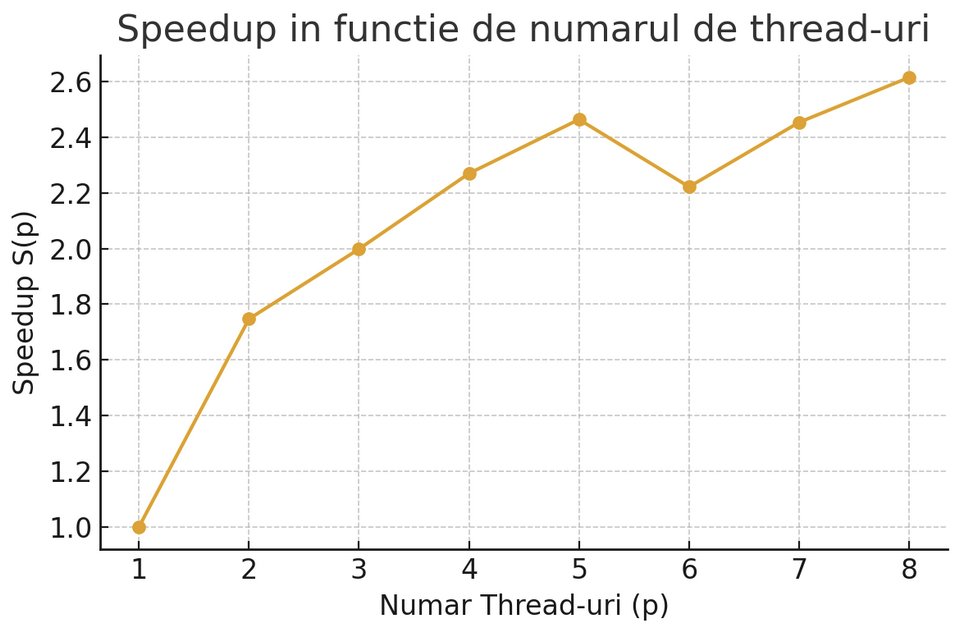

# Parallelization Strategy

## Work Distribution
<h3>

I used an ExecutorService with a fixed number of threads (NUM_THREADS) and divided the execution  
into several clear stages, using Future.get() as a barrier to ensure that one stage is completed  
before the next one begins.

### Reading Articles
Here I used a dynamic approach. I put all file paths into a ConcurrentLinkedQueue.  
Each thread extracts a file from the queue, reads it, and parses it. If a thread finishes a  
small file quickly, it immediately takes another one from the queue, so it never stays idle.

### Reading Auxiliary Inputs
Since these are simple text files, I divided the lines statically (chunks).  
If we have N lines and T threads, each thread received a slice of N/T lines  
to process.

### Deduplication
I performed this in two parallel steps. First, I divided the list of articles into equal chunks  
and each thread counted the occurrences of UUIDs and Titles in a shared map.  
Then, I traversed the list again and kept only the unique articles.

### Sorting
I implemented a Parallel Merge Sort. I split the array into chunks,  
each thread sorted its own chunk, then I performed a final merge  
to obtain the sorted list.

### Article Processing
Here I used dynamic load balancing. I have an atomic counter (processedArticleIndex).  
Threads do not take articles one by one, but instead take a  
“batch” of 50 articles. When a thread finishes its 50 articles, it requests the next index.  
This ensures that if a set of articles is harder to process, the other threads take over  
from the remaining work.

### Writing Results
For the output files, I created one task for each file  
that needed to be written and submitted them to the executor.
</h3>

## Synchronization Elements
<h3>
I tried to avoid explicit synchronized blocks as much as possible to avoid blocking execution,  
relying instead on thread-safe collections and atomic variables:

ConcurrentLinkedQueue: Used during reading to distribute input files without blocking  
threads when requesting a new file.

AtomicInteger: Used as a global cursor (processedArticleIndex) to distribute processing  
batches of articles.

ConcurrentHashMap: Used extensively for storing shared data. It allows simultaneous reads  
and writes without blocking the entire map.

LongAdder: Used for counting categories (categoryCounts). It is faster than AtomicLong or  
Integer in a map when there is a lot of concurrent writing.

Future and Wait: I used the lists of Future<?> returned by executor.submit() to wait for  
the completion of all tasks in a stage before moving on to the next one.

Collections.synchronizedList: Used only at the end, when inserting UUID lists into the  
global maps, to ensure no data is lost during insertion.
</h3>

## Design and Correctness
<h3>
Lock Contention:  
In the processing stage, I do not write directly to the global maps  
(ConcurrentHashMap) for each word found. Instead, each thread has a  
ProcessingResult object with local maps (simple HashMap). The thread performs all  
calculations locally, and only at the end of its execution does it “merge” its results  
into the global map. This eliminates a huge amount of synchronization. Threads work  
independently 99% of the time.  

Dynamic Load Balancing:  
During reading and processing, I did not divide the work statically. If I had done so and one  
thread received very long articles, the other threads would have finished earlier and remained idle.  
By using a queue and an AtomicInteger to take “packages” of work, all threads remain busy  
until the very last second.
</h3>

# Performance and Scalability Analysis

## Test Setup
<h3>
The system configuration is: CPU – Apple M1, 8 cores, 8 GB RAM, macOS Sequoia 15.0.1.  

I used openjdk 23.0.1.  

For testing, I chose the test_5 dataset with 13,789 articles, as it is the largest available in the checker.  

</h3>

## Results

| Number of Threads (p) | Run 1 (s) | Run 2 (s) | Run 3 (s) | Average Time T(p) (s) |
|------------------------|-----------|-----------|-----------|------------------------|
| 1                      | 12.99     | 10.9      | 10.7      | 11.53                  |
| 2                      | 6.87      | 6.43      | 6.51      | 6.60                   |
| 3                      | 5.39      | 6.35      | 5.56      | 5.77                   |
| 4                      | 4.82      | 4.92      | 5.50      | 5.08                   |
| 5                      | 4.65      | 4.42      | 4.97      | 4.68                   |
| 6                      | 6.01      | 4.91      | 4.66      | 5.19                   |
| 7                      | 4.66      | 4.61      | 4.83      | 4.70                   |
| 8                      | 4.37      | 4.00      | 4.87      | 4.41                   |

| p | T(p)  | S(p) = T(1)/T(p) | E(p) = S(p)/p |
| - | ----- | ---------------- | ------------- |
| 1 | 11.53 | 1.000            | 1.000         |
| 2 | 6.60  | 1.747            | 0.873         |
| 3 | 5.77  | 1.998            | 0.666         |
| 4 | 5.08  | 2.270            | 0.567         |
| 5 | 4.68  | 2.464            | 0.493         |
| 6 | 5.19  | 2.222            | 0.370         |
| 7 | 4.70  | 2.453            | 0.350         |
| 8 | 4.41  | 2.615            | 0.327         |

## Analysis and Conclusions
<h3>
Performance increases significantly between 1 and 5 threads, followed by stabilization between 5 and 8.  

The maximum speedup achieved is approximately 2.6x with 8 threads.  

Performance stabilization occurs at 5 threads.  

Possible causes for limited scalability:
- Synchronization overhead: In phases where threads coordinate or share common resources (maps, queues, counters), additional costs appear.
- Thread scheduling overhead: On a system with 8 cores, using more than 5 threads may lead to context switching and scheduling overhead.
- Simultaneous access to shared concurrent resources.
- Dataset size: With a relatively small number of articles (13,789), the overhead of parallelization may outweigh the benefits gained from work splitting.

The optimal number of threads is 5, where the best compromise between parallelization and overhead is observed.
</h3>
